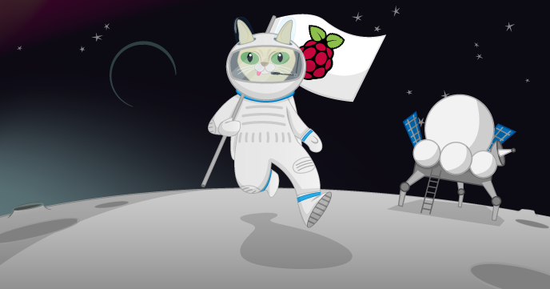

# Gravity Simulator

In this activity, you will learn about the ffects of gravity and how to simulate them in Scratch with code and the Raspberry Pi Foundation's cat Mooncake. 

You can learn more about the forces of gravity and the effects of weightlessness as well as more about British ESA Astronaut Tim Peake's mission aboard the International Space Station on [the UK National STEM Centre website here](http://www.nationalstemcentre.org.uk/timpeake). 

## The worksheet

- Go to the [worksheet](worksheet.md)

## Community
Resource developed based on work by [ESERO-UK](http://www.esero.org.uk/) and [The National STEM Centre](http://www.nationalstemcentre.org.uk/) as part of the Astro Pi project. 

## Licence

Unless otherwise specified, everything in this repository is covered by the following licence:

***Gravity Simulator*** by the [Raspberry Pi Foundation](http://www.raspberrypi.org) is licenced under a [Creative Commons Attribution 4.0 International License](http://creativecommons.org/licenses/by-sa/4.0/).

Based on a work at https://github.com/raspberrypilearning/gravity-simulator
