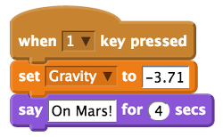

## Simulate gravity on other planets

We know that `-9.81` is a value that calculates the force of gravity on our planet Earth. The force of gravity that pulls everything towards the Earth can be calculated as the mass (size and weight) times the acceleration of gravity. Because we roughly know how large planets are in our solar system, it means that we can apply the same calculation to them. For example, the force of gravity on the planet Mars is `3.71`, whereas on a much larger planet like Jupiter it is `24.8`!

To demonstrate the effects of different gravitational forces from other planets on Mooncake, you can simply add scripts to set the gravity variable.

- Place a `When space key pressed` control block onto the scripts area of the sprite. Click on the drop down box and replace `space` with `1`.

- Add a `set Gravity to 0` block underneath and replace the value `0` with the value `-3.71`.

- Then connect a `say hello for 2 seconds` looks block. Replace the text with `On Mars!` and the value `2` with `4`. This will help remind you which planet Mooncake finds herself on.

- Repeat the steps above for each of the following, remembering to set a new number to switch between planets in the control block `when 0 clicked`:

	- Jupiter = `-24.8`
	- The Moon = `-1.62`
	- Pluto = `-0.65`
	- Earth = `-9.81`

	

