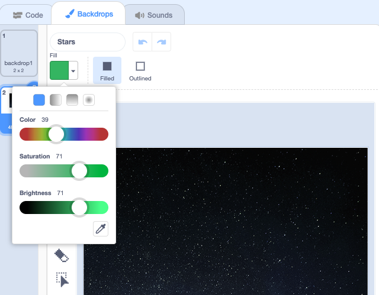

## Create your backdrop

In space it feels like everything is floating, but on Earth everything and everybody is pulled down towards the ground. 

You will set up your project with the **Stars** backdrop and a piece of land pulling the **Dot** sprite towards it. 

--- task ---

Open a [new Scratch project](http://rpf.io/scratch-new){:target="_blank"}. Scratch will open in another browser tab.

--- collapse ---
---
title: Working offline
---
To set up Scratch for offline use, visit [our Scratch guide](https://learning-admin.raspberrypi.org/en/projects/getting-started-scratch/1){:target="_blank"}.
--- /collapse ---
--- /task ---

A backdrop sets the scene by changing the way the Stage looks.

--- task ---

Click on **Choose a Backdrop** from the Stage pane:

--- /task ---

--- task ---

Select the **Space** category and choose the **Stars** backdrop:

--- /task ---

--- task ---

Your Stage should now look like this:

--- /task ---

You will create land at the bottom of the **Stars** backdrop to simulate a planet.

--- task ---

Click on the **Stars** backdrop from the Stage pane. 

--- /task ---

--- task ---

Click on the **Backdrops** tab and choose the **Rectangle** tool:

--- /task ---

--- task ---

Select the **Filled** property. From the menu, move the sliders to pick a green colour:

--- /task ---

--- task ---

Use the mouse to draw a green rectangle at the bottom of the **Stars** backdrop:

**Tip:** Use the **Undo** tool if you need to remove your rectangle so you can redraw it. 

--- /task ---

--- task ---

## Save your project

Type `Gravity simulator` into the project title box at the top of the screen. 

**Tip:** Give your projects helpful names so that you can easily find them when you have lots of projects.

Next, click on **File**, and then on **Save now** to save your project.

If you are not online or you do not have a Scratch account, you can click on **Save to your computer** to save a copy of your project.

--- /task ---

**Sir Isaac Newton** described gravity in 1666 at a time when the laws of nature were unknown. It is rumoured that he stumbled upon the notion of gravity when he watched an apple fall from a tree. The apple fell straight to the ground instead of moving sideways or floating away. 

