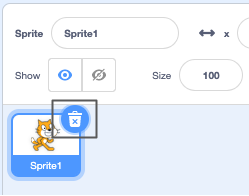
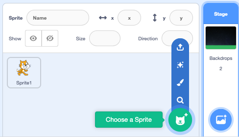
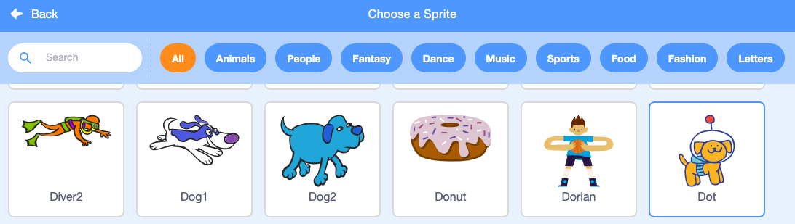
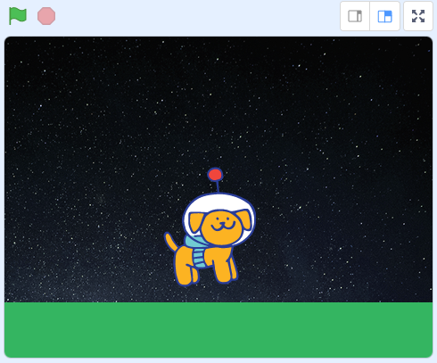

## Add an astronaut

Sprites are objects and characters in Scratch. Can you find a sprite that has already been included in your project? That’s Scratch the cat, but we need a sprite with an astronaut suit. 

--- task ---

Delete the **Sprite1** cat sprite by clicking the trash can in the Sprite list:

--- /task ---

--- task ---

Click on **Choose a Sprite** from the Sprite list:

--- /task ---

--- task ---

Scroll down to find the **Dot** sprite and select it. 

--- /task ---

--- task ---

Your Stage should look like this: 

--- /task ---

--- save ---
