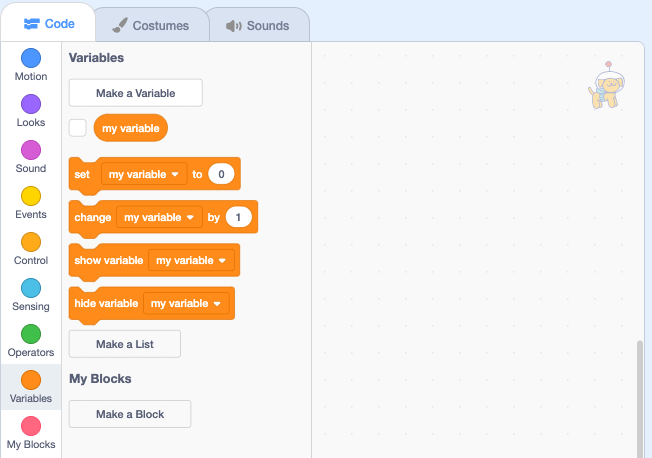
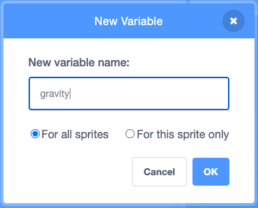
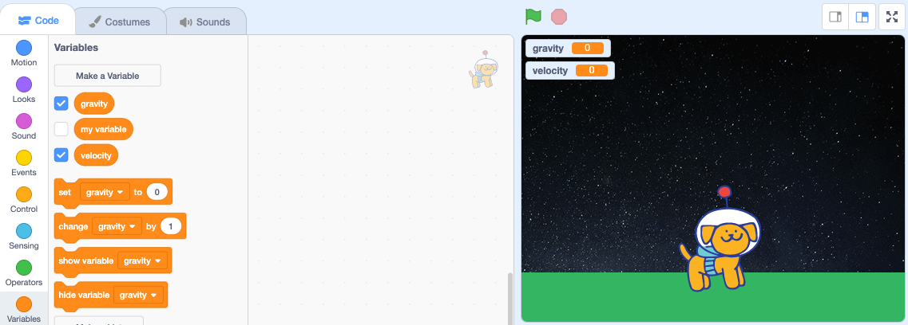

## Set the gravitational pull

Every piece of matter in the universe attracts every other piece of matter. The more matter there is, the stronger the attraction. 

Because you walk on the surface of a huge lump of matter, the Earth, you can feel this downward pull. This pull or attraction we feel is called **gravity**.

You will set the **Dot** sprite to go to the top of the stage when the project starts.

--- task ---

Click on the Code tab for the **Dot** sprite and drag a `When flag clicked`{:class="block3events"} block into the Code area. Add a `go to x y`{:class="block3motion"} block underneath changing the `y`{:class="block3motion"} value to `150`. 

```blocks3
when flag clicked
go to x: (0) y: (150) // the top of the stage
```

**Test:** Click on the green flag to test that the **Dot** sprite moves to the top of the Stage.

--- /task ---

To calculate the force of gravity you will need two variables.

--- task ---

Go to the `Variables`{:class="block3variables"} blocks menu and click on the **Make a Variable** button:



Type 'gravity' as your New variable name and select `For all sprites`:



--- /task ---

--- task ---

Create a second new variable, this time name it 'velocity'. 

A number of `Variable`{:class="block3variables"} blocks are available to use. Your new variables will also appear on the Stage:


--- /task ---

First you are going to simulate gravity on Earth. When an object falls towards Earth it gets faster and faster. The force of gravity on Earth is -9.81 metres per second per second (meaning that for every second of free fall an object's speed will increase 9.81 metres per second).

--- task ---

Add two `set variable to`{:class="block3variables"} blocks to the bottom of your script. Change the values to represent the force of gravity on Earth:

```blocks3
when flag clicked
go to x: (0) y: (150) // the top of the stage
+ set [gravity v] to (-9.81) // the gravitational pull
+ set [velocity v] to (0) // the current speed  
```

--- /task ---

The mathematical equation used to calculate velocity is 'Velocity = Gravity x Time'. In our simulation `velocity`{:class="block3variables"} = `gravity`{:class="block3variables"} x `0.1`.

--- task ---

Add a `forever`{:class="block3control"} loop to the bottom of your script. To create the calculation add a `change velocity by`{:class="block3variables"} block into the loop and insert a `multiply`{:class="block3operators"} block inside. 

Finally add a `gravity`{:class="block3variables"} block and type value `0.1`

```blocks3
when flag clicked
go to x: (0) y: (150) // the top of the stage
set [gravity v] to (-9.81) // the gravitational pull
set [velocity v] to (0)  
+ forever
change [velocity v] by ((gravity)*(0.1))
end
```

--- /task ---

You can now use your velocity variable to change the speed of the **Dot** sprite.

--- task ---

Add a `change y by`{:class="block3motion"} block and insert the `velocity`{:class="block3variables"} block inside.

```blocks3
when flag clicked
go to x: (0) y: (150) // the top of the stage
set [gravity v] to (-9.81) // the gravitational pull
set [velocity v] to (0)   
forever
change [velocity v] by ((gravity)*(0.1))
+ change y by (velocity)
end
```

--- /task ---

--- task ---

**Test:** Try your project to check that the **Dot** sprite falls from the top of the stage when you click the green flag. 

--- /task ---

--- save ---
