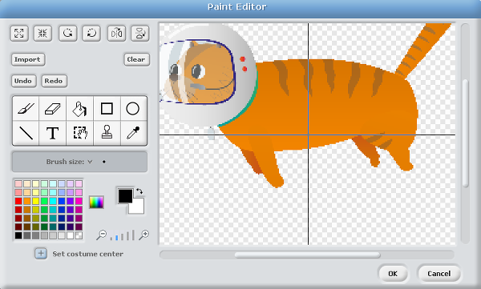

## Set the stage with a space theme

- If you are using a Raspberry Pi you can open Scratch by clicking on **Menu** and **Programming**, followed by **Scratch**. Alternatively, you can use Scratch 2.0 online for this activity although some of the blocks may be slightly different. 

- Create a new file by selecting **File** and **New**.

- Delete the Scratch cat sprite by right-clicking on it and selecting **Delete** from the menu that is displayed.

- For this project, you need to create a new background to act as the Earth. To do this, click on `Stage` in the sprites palette and then click on `Backgrounds` next to the `Scripts` tab.

- Click on `Paint` to draw your own background. Select the rectangle icon and a green colour. It is important that you fill the rectangle with one solid colour. Draw a rectangle of green at the bottom of the image to represent the Earth. Once you are happy with your stage design, click **OK**.

- You'll need to choose a sprite to use as your character. You can use the Scratch cat sprite, or you can use our [Mooncake - the Astro Cat sprite](images/Astro-cat.png).

	*If your Raspberry Pi is connected to the internet you can download this sprite using the link. Save the image somewhere that you will be able to find it later on your Raspberry Pi.*

- Next, add a new sprite by clicking on the middle icon on the sprites palette,  selecting `Astro-cat.png` from the choices and clicking **OK**.

- In order for your gravity simulator to work with this sprite, you will need to `set the costume center` of Mooncake the Astro Cat by selecting the sprite, then clicking on `Costumes` followed by `Edit`. In the Paint Editor window you will see a button with a plus symbol on it. When clicked, it will show a crosshair over the sprite which you will be able to move with your mouse. Move it so that it selects the lower half of Mooncake like this and when you are happy click **OK**:

	

- Click on the `scripts` tab of the sprite and save your Scratch project work by clicking on **File** and **Save As**. Name your program **Gravity simulation** and save it in your home directory or some place that you can find it later.

