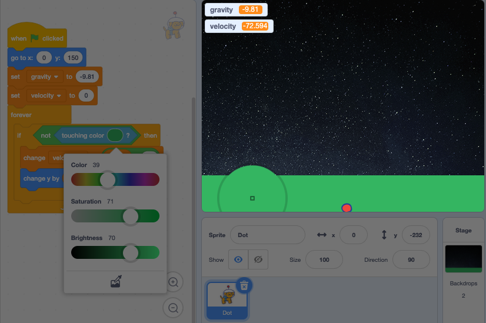

## Landing on the ground

Oh no! Your project simulates gravity but the **Dot** sprite keeps falling when they reach Earth. To solve this you can add code to sense when **Dot** touches land.  

--- task ---

Place an `if`{:class="block3control"} block inside the `forever`{:class="block3control"} loop. 

```blocks3
when flag clicked
go to x: (0) y: (150) // the top of the stage
set [gravity v] to (-9.81) // the gravitational pull
set [velocity v] to (0)   
forever
+ if () then
change [velocity v] by ((gravity)*(0.1))
change y by (velocity)
end
```

--- /task ---

--- task ---

Inside the `if`{:class="block3control"} block add a `not`{:class="block3operators"} operator and a `touching color`{:class="block3sensing"} block. 

Click on the coloured circle and select the **Color picker** tool. Hover over the land on the Stage and click to select the land colour. The circle in the `touching color`{:class="block3sensing"} block will update.



```blocks3
when flag clicked
go to x: (0) y: (150) // the top of the stage
set [gravity v] to (-9.81) // the gravitational pull
set [velocity v] to (0) // the current speed  
forever
+ if <not<touching color (#34B561)?>> then
change [velocity v] by ((gravity)*(0.1))
change y by (velocity)
end
```

--- /task ---

--- task ---

**Test:** Click on the green flag. The **Dot** sprite should now stop when they reach land.

--- /task ---

--- save --- 