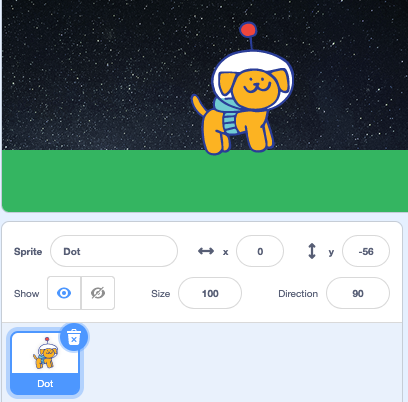

## What goes up must come down

In your gravity simulator the **Dot** sprite falls and lands. **Dot** likes to jump, create a second script to simulate a jump on Earth. 

--- task ---

Drag a `when space key pressed`{:class="block3events"} block to the Code area and create a new script.  Use an `if`{:class="block3control"} block and `touching color`{:class="block3sensing"} block to detect if **Dot** is on land. 

```blocks3
when [space v] key pressed 
if <touching color (#34B561) ?> then
```

--- /task ---

--- task ---

Inside the `if`{:class="block3control"} block add a `set y to`{:class="block3motion"} block and a `set velocity to`{:class="block3variables"} block. The `set y to`{:class="block3motion"} block will have the current y value of the **Dot** sprite.


```blocks3
when [space v] key pressed 
if <touching color (#34B561) ?> then
+ set y to (-56) 
+ set [velocity v] to (10)

```

--- /task ---

--- task ---

Click on the green flag to run your project. When the **Dot** sprite stops moving look at the `y` value in the Sprite pane. 



With this value the **Dot** sprite will not jump as they are touching land. Change the value in the `set y to`{:class="block3motion"} block so that **Dot** moves above land before jumping. 

**Tip:** Experiment by changing the number then pressing space until you find the number that makes **Dot** jump on your backdrop. The number will probably be between 5 - 10 higher so if your y position is `-56` a good value is  `-49`.

```blocks3
set y to (-49) 
```

--- /task ---