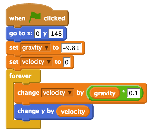

## The simulation loop

In this program you want to change the velocity variable to simulate how gravity works. In physics there are lots of mathematical equations that we use to calculate different forces, including gravity.

To change the velocity variable, you can use this calculation:

```
Velocity = Gravity x Timestep
Velocity = -9.81   x 0.1
```

The value `0.1` is a time step in this program, so that each time around the loop it will be multiplied by `gravity` (which is `-9.81`) and output the velocity.

- Dock a `forever` block (from the `Control` section) beneath your `set velocity` block and place a `change velocity by 0` Variables block inside the `forever` loop.

- Next, take a multiplier Operator block (`0 * 0`) and place it inside the space at the end of the variable block.

- Drag the `gravity` variable and place it in the right side of the multiplication operator, and then type `0.1` in the other.

- The last block needed is a motion block to move the Mooncake sprite. Use the `change y by` Motion block and add it into the loop, then drag the `velocity` variable and add it into the white space in the motion block. The script should look like this:

	

- Save your program and click the green flag to check that it works.

