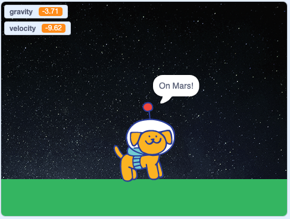

## Simulate gravity on other planets

We know that `-9.81` is a value that calculates the force of gravity on our planet Earth. The force of gravity that pulls everything towards the Earth can be calculated as the mass (size and weight) times the acceleration of gravity. 

Because we roughly know how large planets are in our solar system, it means that we can apply the same calculation to them. For example, the force of gravity on the planet Mars is `-3.71`, whereas on a much larger planet like Jupiter it is `-24.8`!

To demonstrate the effects of different gravitational forces from other planets on the **Dot** sprite, you can simply add scripts to set the gravity variable.

--- task ---

Start a new script by dragging a `when space key pressed`{:class="block3events"} block to the Code area. Replace `space` with `1`. 

```blocks3
when [1 v] key pressed 
```

--- /task ---

--- task ---

Add a `set gravity to`{:class="block3variables"} block and replace the value.

```blocks3
when [1 v] key pressed 
+ set [gravity v] to (-3.71) // force of gravity on Mars
```

--- /task ---

--- task ---

To let users of the simulation know which planet is being shown add a `say hello for 2 seconds`{:class="block3looks"} block and change the values.

```blocks3
when [1 v] key pressed 
set [gravity v] to (-3.71)
+ say [On Mars!] for (4) seconds
```

--- /task ---

--- task ---

**Test:** Click on the green flag to run your simulation. Press the `1` number key to see the gravitational force on Mars. How does it differ from Earth? 




--- /task ---

--- task ---

Repeat the steps above for each of the following, remembering to set a new number to switch between planets in the control block `when key pressed`{:class="block3control"} block:

+ Jupiter = `-24.8`
+ The Moon = `-1.62`
+ Pluto = `-0.65`

--- /task ---

--- task ---

--- /task ---

--- save ---