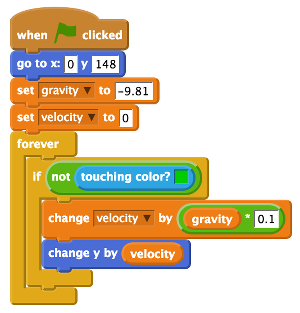

## Landing on the ground

The program so far simulates gravity by dropping Mooncake from the top of the screen to the bottom, but she isn't landing on the carefully drawn Earth. You can change this by adding a **conditional** statement inside the simulation loop.

- Select the Control blocks area and drag an `if` block onto the scripts area. Place it inside the forever loop, wrapping around the `set velocity` and `change y by` blocks.

- Next, set your condition to the `if` block using a `not` operator block, which should be placed into the diamond shape next to the word `if`. Then take the `touching colour?` Sensing block and place it into the space in the `not` operator block.

- The colour shown in the `touching colour` block needs to match the Stage background green colour of Earth. To match them exactly, click on the coloured box inside `touching colour` and the mouse pointer will transform into a little droplet icon. Move your mouse onto the Earth in the Scratch preview window and click on the green colour. The block will change to display the same colour.

	

- Save your program and click the green flag to see if Mooncake will land on the Earth.

