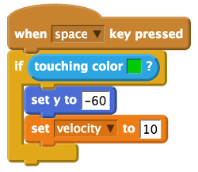

## What goes up must come down

In your gravity simulator Mooncake falls and lands, but so far she can't act like a cat and jump! Let's add another script to fix that!

- Add a `when space key pressed` control block onto the scripts area for the sprite. Connect an `if` conditional control block underneath.

- Drag and drop a `touching colour?` block into the `if` block, remembering to set the colour to match the background like before.

- Next, add a `set y to 0` block into the `if` conditional block and change the value to `-60` .

- To complete your script, add a `set velocity to 0` variable block and change the value to `10`.

	

- Save and run the simulation by clicking on the green flag. Once Mooncake has fallen from the sky and landed, press **space** to make her jump.

