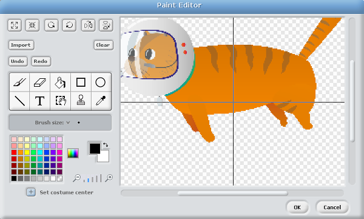
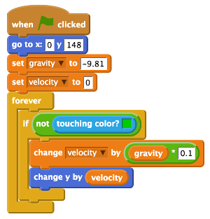
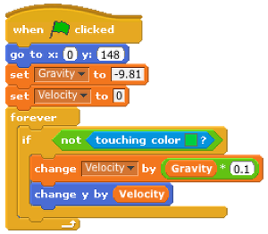
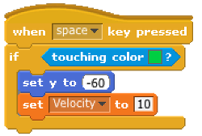
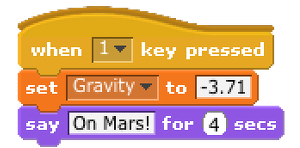

# Simulate the Effects of Gravity on Mooncake 

In space, it feels like everything is floating. This is because everything becomes **weightless** outside of our planet, Earth. This is probably the biggest difference from being on Earth, where everything, and everybody, is pulled down towards the ground. On Earth, we can all feel this downward pull, but we are so used to it that we sometimes do not even think about it. This pull or attraction we feel is called **gravity**.

To this day, no one really knows what gravity “is”. But we do know how gravity works. Every piece of matter in the universe attracts every other piece of matter. The more matter there is, the stronger the attraction; but the attraction decreases when the distance between the pieces of matter increases. For this reason, the planets, which have much less mass than the Sun, orbit the Sun, and the Moon orbits the Earth. Because we walk on the surface of a huge lump of matter, the Earth, these basic facts are not at all obvious. 
	
Sir Isaac Newton is rumoured to have stumbled upon this notion of gravity when he watched an apple fall from a tree. 

You can recreate the effects of the force of gravity on Earth in this Scratch simulation!

## Set the stage with a space theme

1. To begin, open Scratch by clicking on **Menu** and **Programming**, followed by **Scratch**.
1. Create a new file by selecting **File** and **New**.
1. Delete the Scratch cat sprite by right clicking on it and selecting **Delete** from the menu that is displayed.
1. For this project, you need to create a new background to act as the Earth. To do this, click on `stage` in the sprites palette and then click on `Backgrounds` next to the `scripts` tab.
1. Click on `Paint` to draw your own background. Select the rectangle icon and a green colour. This rectangle represents the ground and should be placed at the bottom of the stage area. It is important that you fill the rectangle with one solid colour. Once you are happy with your stage design click **OK**. 	
1. You can use the Scratch cat sprite or alterntively you can use our [Mooncake - the Astro Cat sprite](files/Astro-cat.png). If your Raspberry Pi is connected to the internet you can download this sprite using the link. Save the image somewhere that you will be able to find it later on your Raspberry Pi.
1. Next add a new sprite by clicking on the `import a new sprite` icon on the sprites palette (which looks like the image below) and select `Astro-cat.png` from the choices and click **Ok**.

	

1. In order for your gravity simulator to work with this sprite, you will need to `set the costume center` of Mooncake the Astro Cat by selecting the sprite, clicking on `Costumes` followed by `Edit`. In the Paint Editor window you will see a button with a plus symbol on it. When clicked it will show a crosshair over the sprite which you will be able to move with your mouse. Move it so that it selects the lower half of Mooncake like this and when you are happy click ok:

	
	  	
1. Click on the `scripts` tab of the sprite and save your Scratch project work by clicking on **File** and **Save As**. Name your progam **Gravity simulation** and save it in your home directory or some place that you can find it later.

## Create variables to store data

1. To create a variable, click on `Variables` in the blocks palette and then click `Make a Variable`. The New Variable window opens and asks you to type a name for your variable.
1. Name the first variable `gravity` and ensure that `For all sprites` is checked before clicking **OK**.
	A variable holds a value that can be changed, and can be used elsewhere in your program. 
1. You’ll see some orange blocks are added to your `Variables` area called `gravity`, and a small counter box will appear on the stage.
1. You need to make another variable in the same way as before called `velocity`.

## Setting the start position 

1. Now much of the setup of your program is over, you can start to build the script. Begin your code with a `when green flag clicked` block from the `control` blocks area. 
1. To make sure that Mooncake starts at the top of the screen at the start of the program you will need to set the coordinates. Use a `go to x: 0 y: 148` block from the `Motion` blocks area. 
1. Next you will need to store some data inside your variable blocks. To do this use a `set Gravity to 0` block from the `variables` area and replace the value with `-9.81`, which is the calculation of the force of gravity on Earth. 
1. Set the velocity variable to `0`.

## The simulation loop

1. In this program you want to change the velocity variable to simulate how gravity works. In physics there are lots of mathmatical equations that we use to calculate different forces, including gravity. 

	To change the velocity variable, you can use this calculation, `Velocity = Gravity x Timestep` or `-9.81` multiplied by `0.1`. The value `0.1` is a time step in this program, so that each time around the loop it will be multiplied by `gravity` or `-9.81` and output the velocity. 
	
1. Place a `change Velocity by 0` variable block inside the forever loop. Next take a multiplier operator block `0 * 0` and place it inside the space at the end of the variable block. 
	
1. Drag the `gravity` variable and place it in the right side of the multiplyer operator and then type `0.1` in the other. 	
1. The last block needed is a motion block to move the Mooncake sprite. Use the `change y by` motion block and to add it into the loop. Then drag the `velocity` variable and add it into the white space in the motion block. The script should look like this:

	

1. Save your program and click the green flag to check that it works. 

## Landing on the ground

The program so far simulates gravity by dropping Mooncake from the top of the screen to the bottom, but she isn't landing on the carefully drawn earth. You can change this by adding a **conditional** statement inside the simulation loop. 

1. Select the `control` blocks area and drag an `if` block onto the scripts area. Place it inside the forever loop.

1. Move the `change velocity by Gravity * 0.1` block and `change y by velocity` block to inside the `if` block.

1. Next set your condition to the `if` block using a `not` operator block which should be placed into the diamond shape next to the word `if`. Then take the `touching colour?` sensing block and place it into the space in the `not` operator block. 

1. The colour shown in the `touching colour` block needs to match the stage background earth green colour. To match them exactly, click on the coloured box inside `touching colour` and the mouse pointer will transform into a little droplet icon. Move your mouse onto the Earth in the Scratch preview window and click on the green colour. The block will change to display the same colour.

	

1. Save your program and click the green flag to see if Mooncake will land on the Earth. 
	
## What goes up must come down

In your gravity simulator Mooncake falls and lands, but so far she can not act like a cat and jump! Let's add another script to fix that!

1. Add a `when space key pressed` control block onto the scripts area for the sprite. Connect a `if` conditional control block underneath.

1. Drag and drop a `touching colour` block into the `if` block, remembering to set the colour to match the background like before.

1. Next add a `set y to 0` block into the `if` conditional block and change the value to `-60` .

1. To complete your script, add a `set Velocity to 0` variable block and change the value to `10`.

	

1. Save and run the simulation by clicking on the green flag. Once Mooncake has fallen from the sky and landed. Press **space** to make her jump.

## Simulate gravity on other planets

We know that `-9.81` is a value that calculates the force of gravity on our planet Earth. The force of gravity that pulls everything towards the Earth can be calculated as the mass (size and weight) times the acceleration of gravity. Because we roughly know how large planets are in our solar system it means that we can apply the same calculation to them. For example, the force of gravity on the Mars is `3.71` whereas on a much larger planet like Jupiter it is `24.8`! 

To demonstrate the effects of different gravitational forces from other planets on Mooncake you can simply add scripts to set the gravity variable. 

1. Place a `When space key pressed` control block onto the scripts area of the sprite. Click on the drop down box and replace `space` with `1`.

1. Add a `set Gravity to 0` block underneath and replace the value `0` with the value `-3.71`.

1. Then connect a `say hello for 2 seconds` looks block. Replace the text with `On Mars!` and the value `2` with `4`. This will help remind you which planet Mooncake finds herself on.

1. Repeat the steps above to for each of the following remembering to set a new number to switch between planets in the control block `when 0 clicked`:

	- Jupiter = `-24.8`
	- The Moon = `-1.62`
	- Pluto = `-0.65`
	- Earth = `-9.81`

	

## What next?

- Could you add matching background images for each of your planets?
- If you have a [Sense HAT](https://www.raspberrypi.org/products/sense-hat/), could you use it to trigger the timer instead of using the keyboard?
- Have you enjoyed this Astro Pi mission resource? Why not try one of our others, like this [Astronaut reaction time game](https://www.raspberrypi.org/learning/astronaut-reaction-times/)?

